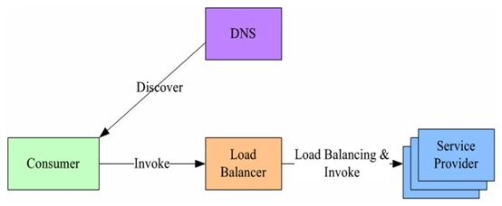
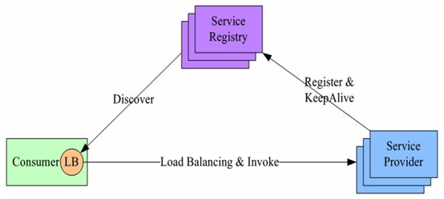
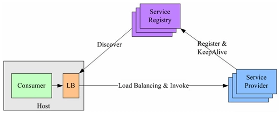

# lb的方式
## Proxy Model
 - LB上有所有服务的地址映射表，通常由运维配置注册
 - 当服务消费方调用某个目标服务时，它向LB发起请求，由LB以某种策略，比如轮询（Round-Robin）做负载均衡后将请求转发到目标服务
 - LB一般具备健康检查能力，能自动摘除不健康的服务实例
 - 问题：服务消费方、提供方之间增加了一级，有一定性能开销，请求量大时，效率较低
 - 其他问题：一旦负载均衡服务挂掉，那整个系统将不能使用
    - 可以对负载均衡服务进行DNS负载均衡，通过对一个域名设置多个IP地址，每次DNS解析时轮询返回负载均衡服务地址，从而实现简单的DNS负载均衡
 - 
 
## Balancing-aware Client
- 服务地址注册到服务注册表，定期报心跳到服务注册表以表明服务的存活状态
- 服务消费方要访问某个服务时，它通过内置的LB组件向服务注册表查询，同时缓存并定期刷新目标服务地址列表
- 以某种负载均衡策略选择一个目标服务地址
- 向目标服务发起请求
- 优点：LB和服务发现能力被分散到每一个服务消费者的进程内部，同时服务消费方和服务提供方之间是直接调用，没有额外开销，性能比较好。
- 主要问题：要用多种语言、多个版本的客户端编写和维护负载均衡策略，使客户端的代码大大复杂化

- 

## 独立LB服务 (external_load_balancing_service.jpg)
- 
- 原理基本与第二种类似
- 服务发现功能是主机上的一个独立进程
- 通过同一主机上的独立LB进程做服务发现和负载均衡

    